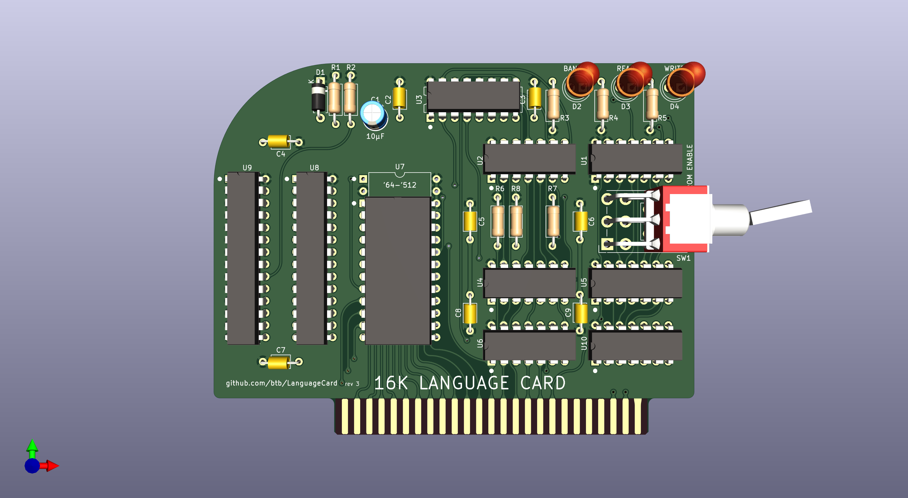

# LanguageCard
 An Apple II Language Card. Based on a design by [iz8dwf](https://youtu.be/1KPIAoO1dTU)

[Interactive BOM](https://btb.github.io/LanguageCard/bom/LanguageCard_3.html)

## Description

This is a simple "language card" for the Apple II and II+, which expands the system from 48K to 64K by means of 16K of RAM, switchable into the address space normally used by the system firmware. That's two banks of 4K in the D0-D8 space, and one bank of 8K in the E0-F8 space. The C0-C8 space is not touched.

Like the original language cards, it can also contain a chip that will be used to replace the F8 ROM on your logic board. Unlike the original language cards, you can enable or disable this replacement ROM with a switch or jumpers. If configured correctly, you can put two different F8 ROM images on a single chip and switch back and forth between them.

## Build Notes

### R3, R4, R5

Use higher resistance for	high-efficiency LEDs, e.g. 3.3K

### U8 and U9

Any narrow 8KBx8	static RAM can be used.	ex: 5C6408, Cy7C185, TC5588

### U7

Optional. 2K or larger	(E)EPROM for overriding the	logic board's F8 ROM. Enable	using SW1 or JP1.

### SW1

Optional Toggle switch. Miniature, Sub-miniature, or Ultra-miniature, right angle, SPDT. (Sub, Ultra-mini use JP1 pads)

An SPST switch which only closes the outer two pin positions can also work if you short JP3. 

To switch between two different F8 ROM images on a single 4K or greater chip, short JP2 and use a	DPDT switch instead - must be a three-position center OFF switch (ON-OFF-ON) in order to disable the card ROM and use the logic board F8 ROM.

### JP1

Enable and select which F8 ROM to use (if not using SW1)

| | |
|-|-|
|6|5|
|4|3|
|2|1|

No Jumpers: Card ROM disabled

#### Using a single ROM image:

JP2 open, Jumper on pins 1,3 (lower right): Card ROM enabled

#### Using two ROM images on a 4K or larger ROM:

JP2 shorted, Jumper on pins 1,3 (lower right) and 2,4 (lower left): Upper ROM image enabled (A11 high)

JP2 shorted, Jumper on pins 3,5 (upper right) and 4,6 (upper left): Lower ROM image enabled (A11 low)

### Solder Jumper JP2
Short, and install DPDT switch	(or use pair of jumpers as above) for	ability to select two different F8	ROM images on a single (4K or larger) ROM. 

### Solder Jumper JP3
Short if using an SPST switch	that only connects outer two pins
